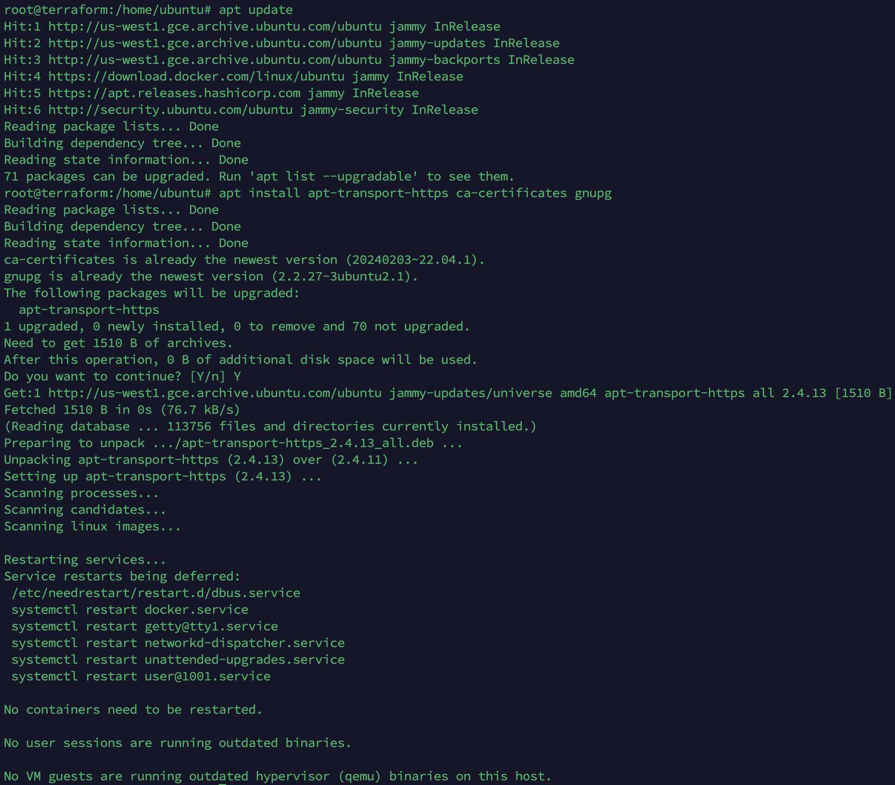

## GCP 설정 방법
### 1. 시스템 패키지 업데이트

```
sudo apt update & sudo apt install apt-transport-https ca-certificates gnupg
```

### 2. Apt List 등록

```
echo "deb [signed-by=/usr/share/keyrings/cloud.google.gpg] https://packages.cloud.google.com/apt cloud-sdk main" | sudo tee -a /etc/apt/sources.list.d/google-cloud-sdk.list
```

### 3. GPG Key 등록

```
curl https://packages.cloud.google.com/apt/doc/apt-key.gpg | sudo apt-key --keyring /usr/share/keyrings/cloud.google.gpg add -
```

### 4. google-cloud-cli 설치

```
sudo apt update & sudo apt install google-cloud-cli
```

### 5. google-cloud-cli 버전 확인

```
gcloud --version
```

### 6. google-cloud-cli 자격 증명

```
gcloud init --console-only
```

```
브라우저 주소로 이동하여 GCP 계정을 인증하고, 해당 Key를 복사하여 붙어넣기 하여 인증합니다.
```

```
GCP에 사용중인 프로젝트를 선택하거나, 새로 프로젝트를 만듭니다.
이후 default로 사용할 리전을 선택해주시면 됩니다.
```

## GCP 사용 방법
* [GCP 사용 방법](GoogleCloudStart.md)