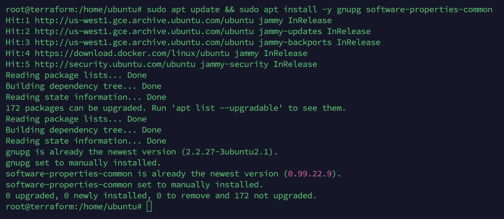
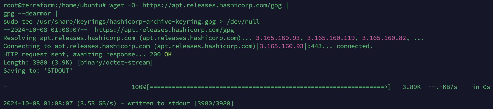
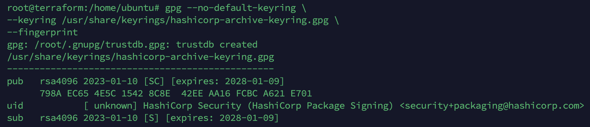
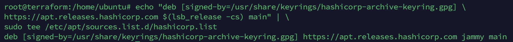
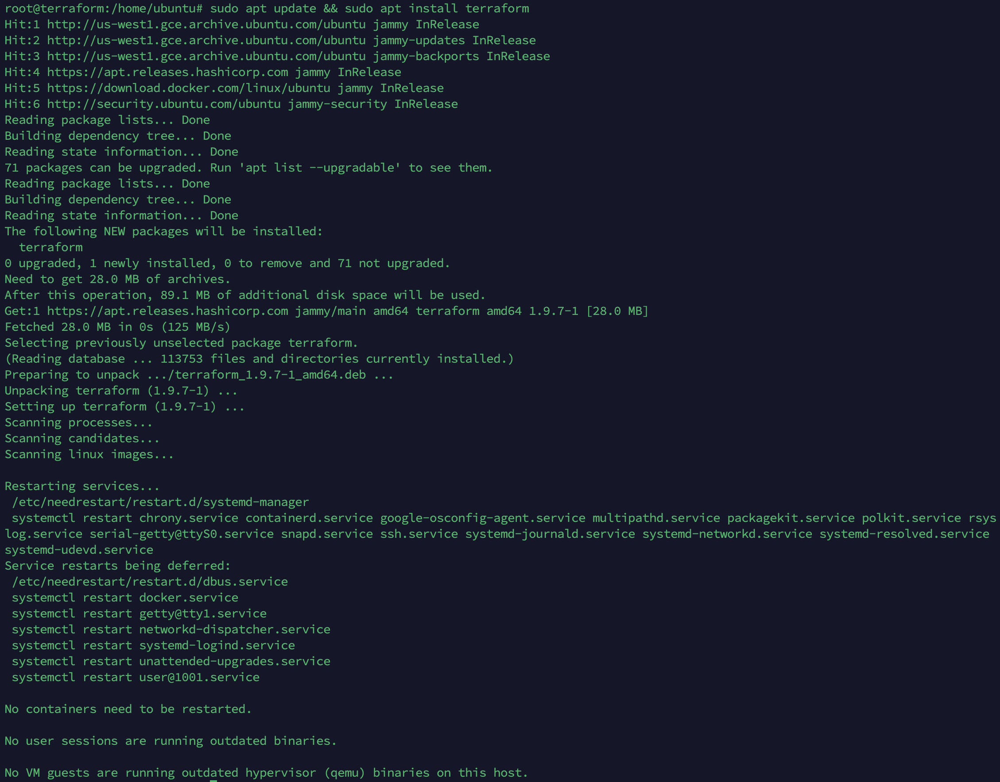
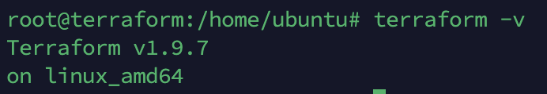

## Terraform 설치 가이드 (Ubuntu/Debian)
이 가이드는 Ubuntu/Debian 시스템에 Terraform을 설치하는 방법을 안내합니다.

### 1. 시스템 패키지 업데이트

```
sudo apt update && sudo apt install -y gnupg software-properties-common
```

### 2. HashiCorp GPG Key 등록

```
wget -O- https://apt.releases.hashicorp.com/gpg | \
gpg --dearmor | \
sudo tee /usr/share/keyrings/hashicorp-archive-keyring.gpg > /dev/null
```

### 3. GPG Fingerprint 확인 (선택)

```
gpg --no-default-keyring \
--keyring /usr/share/keyrings/hashicorp-archive-keyring.gpg \
--fingerprint
```

### 4. HashiCorp Repository 추가

```
echo "deb [signed-by=/usr/share/keyrings/hashicorp-archive-keyring.gpg] \
https://apt.releases.hashicorp.com $(lsb_release -cs) main" | \
sudo tee /etc/apt/sources.list.d/hashicorp.list
```

### 5. Terraform 설치

```
sudo apt update && sudo apt install terraform
```

### 6. 설치 확인

```
terraform -v
```
## Terraform 기본 명령어
| 명령어  | 상세 설명 |
|---|---|
| `terraform init` | `terraform init` 명령어를 실행하면 필요한 플러그인과 모듈을 다운로드하고 작업 디렉토리를 초기화합니다.(필수) |
| `terraform plan` | `terraform apply` 명령어를 실행하기 전에 변경 사항을 미리 확인할 수 있습니다. |
| `terraform apply` | 실제로 인프라를 생성, 변경, 삭제합니다. `-auto-approve` 옵션을 사용하면 확인 없이 바로 적용됩니다. |
| `terraform destroy` | Terraform으로 관리하는 모든 리소스를 삭제합니다. `-auto-approve` 옵션을 사용하면 확인 없이 바로 삭제됩니다. |
| `terraform fmt` | Terraform 코드 스타일을 일관되게 유지하기 위해 코드를 자동으로 포맷팅합니다. |
| `terraform validate` | Terraform 코드의 문법 오류를 검사합니다. |
| `terraform show` | 현재 Terraform 상태 정보를 출력합니다. |
| `terraform refresh` | Terraform 상태 정보를 실제 인프라 상태와 동기화합니다. |

## GCP Terraform 설정
* [GCP 설정 방법](GoogleCloudInit.md)
* [GCP 사용 방법](GCP.md)